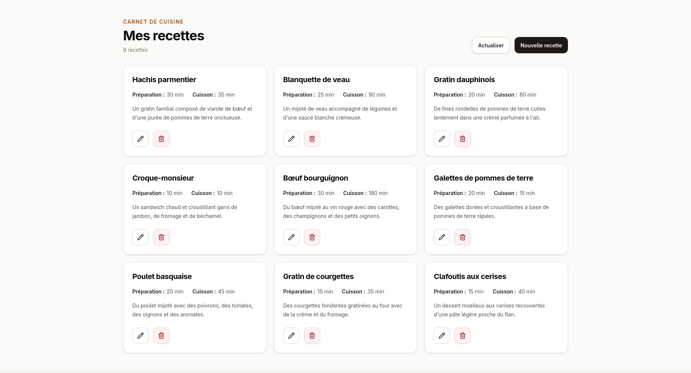

# Recipe Book - AdonisJS, Inertia et React

Recipe Book est une application web full-stack pédagogique de gestion de recettes, construite avec AdonisJS, Lucid ORM, SQLite, Inertia.js et React. Elle permet de consulter, de créer, de modifier et de supprimer des recettes comprenant un nom, une description, un temps de préparation et un temps de cuisson.



## Objectifs d'apprentissage

Ce projet sert de support pour pratiquer :

- la création d'une application AdonisJS avec des controllers, routes et middlewares ;
- la persistance des données avec Lucid ORM, les migrations et SQLite ;
- la validation des formulaires avec VineJS ;
- la création d'une interface React avec Inertia.js ;
- la gestion des formulaires, des erreurs de validation et des messages flash ;
- l'utilisation de Vite, Tailwind CSS et TypeScript dans une application full-stack ;
- la mise en place d'un seeder pour charger des données de démonstration.

## Fonctionnalités

- affichage de la liste des recettes et de leurs durées ;
- création d'une recette avec nom, description, temps de préparation et temps de cuisson ;
- modification d'une recette existante ;
- suppression d'une recette depuis la liste ;
- validation des champs côté serveur ;
- messages de confirmation après création, modification et suppression ;
- pages de connexion et d'inscription ;
- données de démonstration comprenant dix recettes françaises ;
- stockage local des données dans une base SQLite.

## Architecture

Le projet est organisé comme une application AdonisJS complète :

- `app/` : controllers, models, validators, transformers et middlewares ;
- `database/` : migrations, schéma et seeder de recettes ;
- `inertia/` : pages, layouts, composants React et styles de l'interface ;
- `config/` : configuration AdonisJS, Lucid, session, auth, CORS, Shield et Vite ;
- `start/` : routes HTTP et configuration de démarrage.

## Installation

### Prérequis

- Node.js 24 ou supérieur ;
- pnpm.

Installer les dépendances depuis la racine du projet :

```bash
pnpm install
```

Créer le fichier d'environnement local :

```bash
cp .env.example .env
```

Générer la clé d'application si `APP_KEY` est vide :

```bash
node ace generate:key
```

Créer la base SQLite et appliquer les migrations :

```bash
node ace migration:run
```

Charger les recettes de démonstration :

```bash
node ace db:seed
```

Le seeder ajoute les recettes uniquement lorsque la table `recipes` est vide et ne modifie pas une base contenant déjà des données.

## Démarrage

Lancer l'application en développement :

```bash
pnpm dev
```

L'application est accessible sur `http://localhost:3333`.
